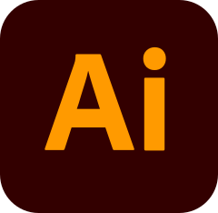

# &#x1F44B; Ciao a tutti / Hi there!

### :adult: Chi sono / About me.

Hi, my name is `Giuseppe` and I'm a `front-end and back-end developer` with a strong focus on design. I'm currently working to improve my skills and become a `full stack web developer` in the near future. I'm passionate about technology and love creating intuitive and functional solutions for users.

Ciao, mi chiamo `Giuseppe` e sono uno `sviluppatore front-end e back-end` con una forte inclinazione per il design. Attualmente sto lavorando per migliorare le mie competenze e diventare un `full stack web developer` nel prossimo futuro. Sono appassionato di tecnologia e amo creare soluzioni intuitive e funzionali per gli utenti.

---

### :man_technologist: Tech Stack.

#### :computer: Software.

    
    
    

#### :globe_with_meridians: Browser.

    
    

#### Technologies I use

    
    

